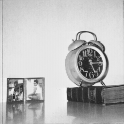
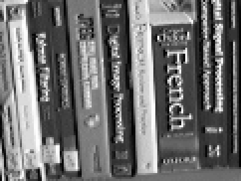

<!-- .slide: data-background-image="static/pocsVsMagFactor/estImSFNN_mFac16.png" data-background-repeat="repeat" data-background-size="45%"  data-background-opacity="0.15"-->

<!-- .element: class="banner" -->
  
## Multi-Frame Super-resolution: A Set Theoretic Approach
### Carrie Flint

     
 
Note: test note  

<!--s-->   
<!-- .element: class="banner" -->             
<!-- .slide: data-background-image="static/noAlias.png" data-background-repeat="repeat" data-background-size="40%"  data-background-opacity="0.15"--> 
# Introduction 

<!--v-->
     
## The problem  
<!-- .slide: class="content" -->
Discrete sampling of continuous signals imposes geometrical resolution limit, i.e. <!-- .element: class="fragment" data-fragment-index="0" --> _aliasing_ <!-- .element: class="fragment" data-fragment-index="1" -->

   <!-- .element: class="fragment" data-fragment-index="2"-->
  <!-- .element: class="fragment" data-fragment-index="2"-->

<!--v-->
## Fequency Spectrum
High frequency information is misrepresented in the lower frequencies <!-- .element: class="fragment" data-fragment-index="1" --->

 <!-- .element: class="fragment" data-fragment-index="2"--->
 <!-- .element: class="fragment" data-fragment-index="2"--->

<!--v-->

## Definition

> Super-resolution imaging (SR) is a class of techniques that enhance the resolution of an imaging system. In some SR techniques—termed optical SR—the diffraction limit of systems is transcended, while in others—geometrical SR—the resolution of digital imaging sensors is enhanced.

<!--v-->
## Goals 
<!-- .element: class="content" style="padding: 0.1;" -->

* Overcome the image resolution limit imposed by discrete sampling grid, i.e. <!-- .element: class="fragment" data-fragment-index="0"--> _geometrical SR_ <!-- .element: class="fragment" data-fragment-index="1" -->
* Reconstruct high resolution image from a series of <!-- .element: class="fragment" data-fragment-index="2"--> _non-redundant_ low resolution images <!-- .element: class="fragment" data-fragment-index="2"-->
* Study performance on <!-- .element: class="fragment" data-fragment-index="3"--> _simulated_ data as a function of: <!-- .element: class="fragment" data-fragment-index="3"-->
    * number of iterations <!-- .element: class="fragment" data-fragment-index="4"-->
    * number of low resolution images <!-- .element: class="fragment" data-fragment-index="5"-->
    * magnification factor <!-- .element: class="fragment" data-fragment-index="6"-->
* Demonstrate performance on <!-- .element: class="fragment" data-fragment-index="7"--> _real\-world_ video sequence <!-- .element: class="fragment" data-fragment-index="7"-->

<!--s-->

# Approach
<!-- .slide: class="banner" -->
<!-- .slide: data-background-image="static/pocs_illustration.png" data-background-repeat="repeat" data-background-size="45%"  data-background-opacity="0.15"-->

<!--v-->

## Projections onto convex sets
* Guaranteed to converge! <!-- .element: class="fragment" data-fragment-index="0" -->
* Solution <!-- .element: class="fragment" data-fragment-index="1" --> _not_ guaranteed to be unique <!-- .element: class="fragment" data-fragment-index="1" -->
  
  <!-- .element: class="fragment" data-fragment-index="3" -->

$$ \hat{\underline{X}}\_{i\+1} = P\_JP\_{J\-1}... P\_2 P\_1\vec{y}\_i $$ <!-- .element: class="fragment" data-fragment-index="4" -->
<!--v-->
    
## Modeling the Problem

  
$ D\_kB\_kG\_k\underline{X} + E\_k $ for $k$ in 1..N
<!--v-->

## Constraint sets
* A variety of constraints can be applied to the problem: <!-- .element: class="fragment" -->
    * Amplitude, data consistency, bandlimitedness, bounded energy etc <!-- .element: class="fragment" -->
* Amplitude constraint: <!-- .element: class="fragment" -->
  $$C_A = \left\\{x(l_1,l_2): A_1 \leq x(l_1,l_2) \leq A_2 \right\\}~\forall(l_1,l_2)$$  <!-- .element: class="fragment" -->
* Data consistency constraint: <!-- .element: class="fragment" -->
  $$ \begin{aligned} C\_k(m_1,m_2) &= \left\\{ \underline{X}: \left| r_k(m_1,m_2) \right| \leq \delta_k(m_1,m_2) \right\\}~~1 \leq k \leq N;~\forall(m_1,m_2)~\epsilon~\theta_k & \\\\
   r_k(m_1,m_2) &= y_k(m_1,m_2) - \hat{y}_k(m_1,m_2) & \\\\ \hat{y}\_k(m_1,m_2) &= [D\_kB\_kG\_k\underline{X}]\_{(m_1,m_2)} &  \end{aligned}$$ <!-- .element: class="fragment" -->
* The most difficult part of POCS involves the complexity of the projection operator <!-- .element: class="fragment" -->
* The above constraints result in <!-- .element: class="fragment" --> _convex_ sets of high-dimensional cubes <!-- .element: class="fragment" -->

<!--v-->

## Metrics 

* Residual Error: how well does the reconstructed image match the observations <!-- .element: class="fragment" -->
  $$ E^2\_{res} = \frac{\sum |\hat{y}(m\_1,m\_2,k)-y(m\_1,m\_2,k)|^2}{\sum |y(m\_1,m\_2,k)|^2} $$
* Reconstruction Error: how well does the reconstructed image match the ground truth image <!-- .element: class="fragment" -->
  $$ E^2\_{rec} = \frac{\sum |\hat{x}(l\_1,l\_2)-x(l\_1,l\_2)|^2}{\sum |x(l\_1,l\_2)|^2} $$
* Sharpness: how much high-frequency information is in the reconstructed image <!-- .element: class="fragment" -->
  $$ S\_1 = \frac{\sum |\hat{x}(l\_1,l\_2)|^4}{\sum |x(l\_1,l\_2)|^4} $$
<!--s-->
<!-- .slide: class="banner" -->
<!-- .slide: data-background-image="static/pocsVsNumIters/imGT.png" data-background-repeat="repeat" data-background-size="45%"  data-background-opacity="0.15"-->

# Results 
## Number of Iterations 

<!--v--> 
<!-- .slide: id="clockGT" data-transition="None" data-transition-speed="fast" data-background-opacity="0.25" -->

| ground truth	| [low resolution](#/clockNN)	| [bilinear](#/clockBL) | [error metrics](#/clockErrorMetrics)|
|:------------:	|:--:	|:--:	|:--:	|

| # Iterations: 	| [10](#/clock10) 	| [50](#/clock50) 	|[100](#/clock100) 	| [1000](#/clock1000)	|
|:------------:	|:--:	|:--:	|:---:	|:---:	|

  

<!--v-->
<!-- .slide: id="clockNN" data-transition="None" data-transition-speed="fast" -->

| [ground truth](#/clockGT)	| low resolution	| [bilinear](#/clockBL) | [error metrics](#/clockErrorMetrics)| 	
|:------------:	|:--:	|:--:	|

| # Iterations: 	| [10](#/clock10) 	| [50](#/clock50) 	|[100](#/clock100) 	| [1000](#/clock1000)	|
|:------------:	|:--:	|:--:	|:---:	|:---:	|

  

<!--v-->
<!-- .slide: id="clockBL" data-transition="None" data-transition-speed="fast" -->

| [ground truth](#/clockGT)	| [low resolution](#/clockNN)	| bilinear 	| [error metrics](#/clockErrorMetrics)|
|:------------:	|:--:	|:--:	|

| # Iterations: 	| [10](#/clock10) 	| [50](#/clock50) 	|[100](#/clock100) 	| [1000](#/clock1000)	|
|:------------:	|:--:	|:--:	|:---:	|:---:	|

  

<!--v-->
<!-- .slide: id="clock10" data-transition="None" data-transition-speed="fast" -->

| [ground truth](#/clockGT) 	| [low resolution](#/clockNN)	| [bilinear](#/clockBL) | [error metrics](#/clockErrorMetrics)| 	
|:------------:	|:--:	|:--:	|

| # Iterations: 	| 10	| [50](#/clock50) 	|[100](#/clock100) 	| [1000](#/clock1000)	|
|:------------:	|:--:	|:--:	|:---:	|:---:	|

  

<!--v-->
<!-- .slide: id="clock50" data-transition="None" data-transition-speed="fast" center="false" -->

| [ground truth](#/clockGT) 	| [low resolution](#/clockNN)	| [bilinear](#/clockBL) | [error metrics](#/clockErrorMetrics)| 	
|:------------:	|:--:	|:--:	|

| # Iterations: 	| [10](#/clock10) 	| 50	| [100](#/clock100) 	|  [1000](#/clock1000)	|
|:------------:	|:--:	|:--:	|:---:	|:---:	|

  

<!--v-->
<!-- .slide: id="clock100" data-transition="None" data-transition-speed="fast" center="false" -->

| [ground truth](#/clockGT) 	| [low resolution](#/clockNN)	| [bilinear](#/clockBL) | [error metrics](#/clockErrorMetrics)| 	
|:------------:	|:--:	|:--:	|

| # Iterations: 	| [10](#/clock10)  	| [50](#/clock50)  	| 100  	| [1000](#/clock1000)	|
|:------------:	|:--:	|:--:	|:---:	|:---:	|

   

<!--v-->
<!-- .slide: id="clock1000" data-transition="None" data-transition-speed="fast" center="false" -->
| [ground truth](#/clockGT) 	| [low resolution](#/clockNN)	| [bilinear](#/clockBL) | [error metrics](#/clockErrorMetrics)| 	
|:------------:	|:--:	|:--:	|

| # Iterations: 	| [10](#/clock10)  	| [50](#/clock50) 	| [100](#/clock100) 	| 1000	|
|:------------:	|:--:	|:--:	|:---:	|:---:	|

 

<!--v-->
<!-- .slide: id="clockErrorMetrics" data-transition="None" data-transition-speed="fast" center="false" -->
| [ground truth](#/clockGT) 	| [low resolution](#/clockNN)	| [bilinear](#/clockBL) | error metrics | 	
|:------------:	|:--:	|:--:	|

| # Iterations: 	| [10](#/clock10)  	| [50](#/clock50) 	| [100](#/clock100) 	| [1000](#/clock1000) 	|
|:------------:	|:--:	|:--:	|:---:	|:---:	|

 
 

<!--s-->
<!-- .slide: class="banner" -->
<!-- .slide: data-background-image="static/pocsVsNumObs/imGT.png" data-background-repeat="repeat" data-background-size="45%"  data-background-opacity="0.15"-->
# Results
## Number of Observations

<!--v-->
<!-- .slide: id="rheesGT4" data-transition="None" data-transition-speed="fast" -->

| ground truth	| [low resolution](#/rheesNN4)	| [bilinear](#/rheesBL4) 	| 	[error metrics](#/pocsVsNumObsMetrics) |	
|:------------:	|:--:	|:--:	|:--:	|

| # Frames: 	| [*4*](#/rhees4) 	| [8](#/rheesGT8) 	|[16](#/rheesGT16) 	| [32](#/rheesGT32)	|
|:------------:	|:--:	|:--:	|:---:	|:---:	|

  

<!--v-->
<!-- .slide: id="rheesNN4" data-transition="None" data-transition-speed="fast" -->

| [ground truth](#/rheesGT4)	| low resolution	| [bilinear](#/rheesBL4) 	| [error metrics](#/pocsVsNumObsMetrics) |		
|:------------:	|:--:	|:--:	|:--:	|

| # Frames: 	| [*4*](#/rhees4) 	| [8](#/rheesNN8) 	|[16](#/rheesNN16) 	| [32](#/rheesNN32)	|
|:------------:	|:--:	|:--:	|:---:	|:---:	|

  

<!--v-->
<!-- .slide: id="rheesBL4" data-transition="None" data-transition-speed="fast" -->

| [ground truth](#/rheesGT4)	| [low resolution](#/rheesNN4)	| bilinear 	| 	[error metrics](#/pocsVsNumObsMetrics) |	
|:------------:	|:--:	|:--:	|:--:	|

| # Frames: 	| [*4*](#/rhees4) 	| [8](#/rheesBL8) 	|[16](#/rheesBL16) 	| [32](#/rheesBL32)	|
|:------------:	|:--:	|:--:	|:---:	|:---:	|

 

<!--v-->

<!-- .slide: id="rhees4" data-transition="None" data-transition-speed="fast" -->

| [ground truth](#/rheesGT4)	| [low resolution](#/rheesNN4)	| [bilinear](#/rheesBL4) 	| 	[error metrics](#/pocsVsNumObsMetrics) |	
|:------------:	|:--:	|:--:	|:--:	|

| # Frames: 	| 4 	| [8](#/rhees8) 	|[16](#/rhees16) 	| [32](#/rhees32)	|
|:------------:	|:--:	|:--:	|:---:	|:---:	|

  

<!--v-->
<!-- .slide: id="rheesGT8" data-transition="None" data-transition-speed="fast" -->

| ground truth	| [low resolution](#/rheesNN8)	| [bilinear](#/rheesBL8) 	| 	[error metrics](#/pocsVsNumObsMetrics) |	
|:------------:	|:--:	|:--:	|:--:	|

| # Frames: 	| [4](#/rheesGT4) 	| [*8*](#/rhees8) 	|[16](#/rheesGT16) 	| [32](#/rheesGT32)	|
|:------------:	|:--:	|:--:	|:---:	|:---:	|

  

<!--v-->
<!-- .slide: id="rheesNN8" data-transition="None" data-transition-speed="fast" -->

| [ground truth](#/rheesGT8)	| low resolution	| [bilinear](#/rheesBL8) 	| [error metrics](#/pocsVsNumObsMetrics) |		
|:------------:	|:--:	|:--:	|:--:	|

| # Frames: 	| [4](#/rheesNN4) 	| [*8*](#/rhees8) 	|[16](#/rheesNN16) 	| [32](#/rheesNN32)	|
|:------------:	|:--:	|:--:	|:---:	|:---:	|

  

<!--v-->
<!-- .slide: id="rheesBL8" data-transition="None" data-transition-speed="fast" -->

| [ground truth](#/rheesGT8)	| [low resolution](#/rheesNN8)	| bilinear 	| [error metrics](#/pocsVsNumObsMetrics) |	
|:------------:	|:--:	|:--:	|:--:	|

| # Frames: 	| [4](#/rheesBL4) 	| [*8*](#/rhees8) 	|[16](#/rheesBL16) 	| [32](#/rheesBL32)	|
|:------------:	|:--:	|:--:	|:---:	|:---:	|

 

<!--v-->

<!-- .slide: id="rhees8" data-transition="None" data-transition-speed="fast" -->

| [ground truth](#/rheesGT8)	| [low resolution](#/rheesNN8)	| [bilinear](#/rheesBL8) 	| 	[error metrics](#/pocsVsNumObsMetrics) |	
|:------------:	|:--:	|:--:	|:--:	|

| # Frames: 	| [4](#/rhees4) 	| 8  	|[16](#/rhees16) 	| [32](#/rhees32)	|
|:------------:	|:--:	|:--:	|:---:	|:---:	|

  

<!--v-->
<!-- .slide: id="rheesGT16" data-transition="None" data-transition-speed="fast" -->

| ground truth	| [low resolution](#/rheesNN16)	| [bilinear](#/rheesBL16) 	| 	[error metrics](#/pocsVsNumObsMetrics) |	
|:------------:	|:--:	|:--:	|:--:	|

| # Frames: 	| [4](#/rheesGT4) 	| [8](#/rheesGT8) 	|[*16*](#/rhees16) 	| [32](#/rheesGT32)	|
|:------------:	|:--:	|:--:	|:---:	|:---:	|

  

<!--v-->
<!-- .slide: id="rheesNN16" data-transition="None" data-transition-speed="fast" -->

| [ground truth](#/rheesGT16)	| low resolution	| [bilinear](#/rheesBL16) 	| [error metrics](#/pocsVsNumObsMetrics) |		
|:------------:	|:--:	|:--:	|:--:	|

| # Frames: 	| [4](#/rheesNN4) 	| [8](#/rheesNN8) 	|[*16*](#/rhees16) 	| [32](#/rheesNN32)	|
|:------------:	|:--:	|:--:	|:---:	|:---:	|

  

<!--v-->
<!-- .slide: id="rheesBL16" data-transition="None" data-transition-speed="fast" -->

| [ground truth](#/rheesGT16)	| [low resolution](#/rheesNN16)	| bilinear 	| [error metrics](#/pocsVsNumObsMetrics) |	
|:------------:	|:--:	|:--:	|:--:	|

| # Frames: 	| [4](#/rheesBL4) 	| [8](#/rheesBL8) 	|[*16*](#/rhees16) 	| [32](#/rheesBL32)	|
|:------------:	|:--:	|:--:	|:---:	|:---:	|

 

<!--v-->

<!-- .slide: id="rhees16" data-transition="None" data-transition-speed="fast" -->

| [ground truth](#/rheesGT16)	| [low resolution](#/rheesNN16)	| [bilinear](#/rheesBL16) 	| 	[error metrics](#/pocsVsNumObsMetrics) |	
|:------------:	|:--:	|:--:	|:--:	|

| # Frames: 	| [4](#/rhees4) 	| [8](#/rhees8)  	| 16 	| [32](#/rhees32)	|
|:------------:	|:--:	|:--:	|:---:	|:---:	|

  

<!--v-->
<!-- .slide: id="rheesGT32" data-transition="None" data-transition-speed="fast" -->

| ground truth	| [low resolution](#/rheesNN32)	| [bilinear](#/rheesBL32) 	| 	[error metrics](#/pocsVsNumObsMetrics) |	
|:------------:	|:--:	|:--:	|:--:	|

| # Frames: 	| [4](#/rheesGT4) 	| [8](#/rheesGT8) 	|[16](#/rheesGT16) 	| [*32*](#/rhees32)	|
|:------------:	|:--:	|:--:	|:---:	|:---:	|

  

<!--v-->
<!-- .slide: id="rheesNN32" data-transition="None" data-transition-speed="fast" -->

| [ground truth](#/rheesGT32)	| low resolution	| [bilinear](#/rheesBL32) 	| [error metrics](#/pocsVsNumObsMetrics) |	
|:------------:	|:--:	|:--:	|:--:	|

| # Frames: 	| [4](#/rheesNN4) 	| [8](#/rheesNN8) 	|[16](#/rheesNN16) 	| [*32*](#/rhees32)	|
|:------------:	|:--:	|:--:	|:---:	|:---:	|

  

<!--v-->
<!-- .slide: id="rheesBL32" data-transition="None" data-transition-speed="fast" -->

| [ground truth](#/rheesGT32)	| [low resolution](#/rheesNN32)	| bilinear 	| [error metrics](#/pocsVsNumObsMetrics) |	
|:------------:	|:--:	|:--:	|:--:	|

| # Frames: 	| [4](#/rheesBL4) 	| [8](#/rheesBL8) 	|[16](#/rheesBL16) 	| [*32*](#/rhees32)	|
|:------------:	|:--:	|:--:	|:---:	|:---:	|

 

<!--v-->

<!-- .slide: id="rhees32" data-transition="None" data-transition-speed="fast" -->

| [ground truth](#/rheesGT32)	| [low resolution](#/rheesNN32)	| [bilinear](#/rheesBL32) 	| 	[error metrics](#/pocsVsNumObsMetrics) |	
|:------------:	|:--:	|:--:	|:--:	|

| # Frames: 	| [4](#/rhees4) 	| [8](#/rhees8)  	|[16](#/rhees16) 	| 32 	|
|:------------:	|:--:	|:--:	|:---:	|:---:	|

  

<!--v-->
<!-- .slide: id="pocsVsNumObsMetrics" data-transition="None" data-transition-speed="fast" center="false" -->
| [ground truth](#/rheesGT4) 	| [low resolution](#/rheesNN4)	| [bilinear](#/rheesBL4) | error metrics | 	
|:------------:	|:--:	|:--:	|:--:	|

| # Frames: 	| [4](#/rhees4)  	| [8](#/rhees8) 	| [16](#/rhees16) 	| [32](#/rhees32) 	|
|:------------:	|:--:	|:--:	|:---:	|:---:	|

 
 

<!--s-->
<!-- .slide: class="banner" -->
<!-- .slide: data-background-image="static/pocsVsMagFactor/imHR_GT.png" data-background-repeat="repeat" data-background-size="45%"  data-background-opacity="0.15"-->
# Results
## Magnification Factor

<!--v-->
<!-- .slide: id="rheesVsMagFactorGT2" data-transition="None" data-transition-speed="fast" -->

| ground truth	| [low resolution](#/rheesVsMagFactorNN2)	| [bilinear](#/rheesVsMagFactorBL2) 	| [error metrics](#/pocsVsMagFactorMetrics) 	| 	
|:------------:	|:--:	|:--:	|

| Magnification Factor: 	| [*2*](#/rheesVsMagFactor2) 	| [4](#/rheesVsMagFactorGT4) 	|[8](#/rheesVsMagFactorGT8) 	| [16](#/rheesVsMagFactorGT16)	|
|:------------:	|:--:	|:--:	|:---:	|:---:	|

  

<!--v-->
<!-- .slide: id="rheesVsMagFactorNN2" data-transition="None" data-transition-speed="fast" -->

| [ground truth](#/rheesVsMagFactorGT2)		| low resolution	| [bilinear](#/rheesVsMagFactorBL2)	| [error metrics](#/pocsVsMagFactorMetrics) 	| 	
|:------------:	|:--:	|:--:	|

| Magnification Factor: 	| [*2*](#/rheesVsMagFactor2) | [4](#/rheesVsMagFactorNN4) 	|[8](#/rheesVsMagFactorNN8) 	| [16](#/rheesVsMagFactorNN16)	|
|:------------:	|:--:	|:--:	|:---:	|:---:	|

  

<!--v-->
<!-- .slide: id="rheesVsMagFactorBL2" data-transition="None" data-transition-speed="fast" -->

| [ground truth](#/rheesVsMagFactorGT2)		| [low resolution](#/rheesVsMagFactorNN2)	| bilinear	| [error metrics](#/pocsVsMagFactorMetrics) 	| 	
|:------------:	|:--:	|:--:	|

| Magnification Factor: 	| [*2*](#/rheesVsMagFactor2)	| [4](#/rheesVsMagFactorBL4) 	|[8](#/rheesVsMagFactorBL8) 	| [16](#/rheesVsMagFactorBL16)	|
|:------------:	|:--:	|:--:	|:---:	|:---:	|

  

<!--v-->
<!-- .slide: id="rheesVsMagFactor2" data-transition="None" data-transition-speed="fast" -->

| [ground truth](#/rheesVsMagFactorGT2)	| [low resolution](#/rheesVsMagFactorNN2)	| [bilinear](#/rheesVsMagFactorBL2) 	| [error metrics](#/pocsVsMagFactorMetrics) 	| 	
|:------------:	|:--:	|:--:	|

| Magnification Factor: 	| 2	| [4](#/rheesVsMagFactor4) 	|[8](#/rheesVsMagFactor8) 	| [16](#/rheesVsMagFactor16)	|
|:------------:	|:--:	|:--:	|:---:	|:---:	|

  

<!--v-->
<!-- .slide: id="rheesVsMagFactorGT4" data-transition="None" data-transition-speed="fast" -->

| ground truth	| [low resolution](#/rheesVsMagFactorNN4)	| [bilinear](#/rheesVsMagFactorBL4) 	| [error metrics](#/pocsVsMagFactorMetrics) 	| 	
|:------------:	|:--:	|:--:	|

| Magnification Factor: 	| [2](#/rheesVsMagFactorGT2) 	| [*4*](#/rheesVsMagFactor4) 	|[8](#/rheesVsMagFactorGT8) 	| [16](#/rheesVsMagFactorGT16)	|
|:------------:	|:--:	|:--:	|:---:	|:---:	|

  

<!--v-->
<!-- .slide: id="rheesVsMagFactorNN4" data-transition="None" data-transition-speed="fast" -->

| [ground truth](#/rheesVsMagFactorGT4)		| low resolution	| [bilinear](#/rheesVsMagFactorBL4)	| [error metrics](#/pocsVsMagFactorMetrics) 	| 	
|:------------:	|:--:	|:--:	|

| Magnification Factor: 	| [2](#/rheesVsMagFactorNN2) | [*4*](#/rheesVsMagFactor4) 	|[8](#/rheesVsMagFactorNN8) 	| [16](#/rheesVsMagFactorNN16)	|
|:------------:	|:--:	|:--:	|:---:	|:---:	|

  

<!--v-->
<!-- .slide: id="rheesVsMagFactorBL4" data-transition="None" data-transition-speed="fast" -->

| [ground truth](#/rheesVsMagFactorGT4)		| [low resolution](#/rheesVsMagFactorNN4)	| bilinear	| [error metrics](#/pocsVsMagFactorMetrics) 	| 	
|:------------:	|:--:	|:--:	|

| Magnification Factor: 	| [2](#/rheesVsMagFactorBL2)	| [*4*](#/rheesVsMagFactor4) 	|[8](#/rheesVsMagFactorBL8) 	| [16](#/rheesVsMagFactorBL16)	|
|:------------:	|:--:	|:--:	|:---:	|:---:	|

  

<!--v-->
<!-- .slide: id="rheesVsMagFactor4" data-transition="None" data-transition-speed="fast" -->

| [ground truth](#/rheesVsMagFactorGT4)	| [low resolution](#/rheesVsMagFactorNN4)	| [bilinear](#/rheesVsMagFactorBL4) 	| 	[error metrics](#/pocsVsMagFactorMetrics) 	| 
|:------------:	|:--:	|:--:	|

| Magnification Factor: 	| [2](#/rheesVsMagFactor2) |  4	|[8](#/rheesVsMagFactor8) 	| [16](#/rheesVsMagFactor16)	|
|:------------:	|:--:	|:--:	|:---:	|:---:	|

  

<!--v-->
<!-- .slide: id="rheesVsMagFactorGT8" data-transition="None" data-transition-speed="fast" -->

| ground truth	| [low resolution](#/rheesVsMagFactorNN8)	| [bilinear](#/rheesVsMagFactorBL8) 	|  [error metrics](#/pocsVsMagFactorMetrics) 	| 	
|:------------:	|:--:	|:--:	|

| Magnification Factor: 	| [2](#/rheesVsMagFactorGT2) 	| [4](#/rheesVsMagFactorGT4) 	|[*8*](#/rheesVsMagFactor8) 	| [16](#/rheesVsMagFactorGT16)	|
|:------------:	|:--:	|:--:	|:---:	|:---:	|

  

<!--v-->
<!-- .slide: id="rheesVsMagFactorNN8" data-transition="None" data-transition-speed="fast" -->

| [ground truth](#/rheesVsMagFactorGT8)		| low resolution	| [bilinear](#/rheesVsMagFactorBL8)	| [error metrics](#/pocsVsMagFactorMetrics) 	| 	
|:------------:	|:--:	|:--:	|

| Magnification Factor: 	| [2](#/rheesVsMagFactorNN2) | [4](#/rheesVsMagFactorNN4) 	|[*8*](#/rheesVsMagFactor8) 	| [16](#/rheesVsMagFactorNN16)	|
|:------------:	|:--:	|:--:	|:---:	|:---:	|

  

<!--v-->
<!-- .slide: id="rheesVsMagFactorBL8" data-transition="None" data-transition-speed="fast" -->

| [ground truth](#/rheesVsMagFactorGT8)		| [low resolution](#/rheesVsMagFactorNN8)	| bilinear	| [error metrics](#/pocsVsMagFactorMetrics) 	| 	
|:------------:	|:--:	|:--:	|

| Magnification Factor: 	| [2](#/rheesVsMagFactorBL2)	| [4](#/rheesVsMagFactorBL4) 	|[*8*](#/rheesVsMagFactor8) 	| [16](#/rheesVsMagFactorBL16)	|
|:------------:	|:--:	|:--:	|:---:	|:---:	|

  

<!--v-->
<!-- .slide: id="rheesVsMagFactor8" data-transition="None" data-transition-speed="fast" -->

| [ground truth](#/rheesVsMagFactorGT8)	| [low resolution](#/rheesVsMagFactorNN8)	| [bilinear](#/rheesVsMagFactorBL8) 	| 	[error metrics](#/pocsVsMagFactorMetrics) 	| 
|:------------:	|:--:	|:--:	|

| Magnification Factor: 	| [2](#/rheesVsMagFactor2) | [4](#/rheesVsMagFactor4)  | 8 | [16](#/rheesVsMagFactor16)	|
|:------------:	|:--:	|:--:	|:---:	|:---:	|

  

<!--v-->
<!-- .slide: id="rheesVsMagFactorGT16" data-transition="None" data-transition-speed="fast" -->

| ground truth	| [low resolution](#/rheesVsMagFactorNN16)	| [bilinear](#/rheesVsMagFactorBL16) 	| 	[error metrics](#/pocsVsMagFactorMetrics) 	| 
|:------------:	|:--:	|:--:	|

| Magnification Factor: 	| [2](#/rheesVsMagFactorGT2) 	| [4](#/rheesVsMagFactor4) 	|[8](#/rheesVsMagFactorGT8) 	| [*16*](#/rheesVsMagFactorGT16)	|
|:------------:	|:--:	|:--:	|:---:	|:---:	|

  

<!--v-->
<!-- .slide: id="rheesVsMagFactorNN16" data-transition="None" data-transition-speed="fast" -->

| [ground truth](#/rheesVsMagFactorGT16)		| low resolution	| [bilinear](#/rheesVsMagFactorBL16)	| [error metrics](#/pocsVsMagFactorMetrics) 	| 	
|:------------:	|:--:	|:--:	|

| Magnification Factor: 	| [2](#/rheesVsMagFactorNN2) | [4](#/rheesVsMagFactorNN4) 	|[8](#/rheesVsMagFactorNN8) 	| [*16*](#/rheesVsMagFactor16)	|
|:------------:	|:--:	|:--:	|:---:	|:---:	|

  

<!--v-->
<!-- .slide: id="rheesVsMagFactorBL16" data-transition="None" data-transition-speed="fast" -->

| [ground truth](#/rheesVsMagFactorGT16)		| [low resolution](#/rheesVsMagFactorNN16)	| bilinear	| 	[error metrics](#/pocsVsMagFactorMetrics) 	| 
|:------------:	|:--:	|:--:	|

| Magnification Factor: 	| [2](#/rheesVsMagFactorBL2)	| [4](#/rheesVsMagFactorBL4) 	|[8](#/rheesVsMagFactorBL8) 	| [*16*](#/rheesVsMagFactor16)	|
|:------------:	|:--:	|:--:	|:---:	|:---:	|

  

<!--v-->
<!-- .slide: id="rheesVsMagFactor16" data-transition="None" data-transition-speed="fast" -->

| [ground truth](#/rheesVsMagFactorGT16)	| [low resolution](#/rheesVsMagFactorNN16)	| [bilinear](#/rheesVsMagFactorBL16) 	| [error metrics](#/pocsVsMagFactorMetrics) 	| 	
|:------------:	|:--:	|:--:	|

| Magnification Factor: 	| [2](#/rheesVsMagFactor2) | [4](#/rheesVsMagFactor4)  | [8](#/rheesVsMagFactor8)  | 16 	|
|:------------:	|:--:	|:--:	|:---:	|:---:	|

  

<!--v-->
<!-- .slide: id="pocsVsMagFactorMetrics" data-transition="None" data-transition-speed="fast" center="false" -->
| [ground truth](#/rheesVsMagFactorGT4) 	| [low resolution](#/rheesVsMagFactorNN4)	| [bilinear](#/rheesVsMagFactorBL4) | error metrics | 	
|:------------:	|:--:	|:--:	|

| Magnification Factor:	| [2](#/rheesVsMagFactor2)  	| [4](#/rheesVsMagFactor4) 	| [8](#/rheesVsMagFactor8) 	| [16](#/rheesVsMagFactor16) 	|
|:------------:	|:--:	|:--:	|:---:	|:---:	|

 

<!--s-->

# Results
## Video Sequence
<!-- .slide: class="banner" -->
<!-- .slide: data-background-video="static/Book_case1_small_BW.mp4" data-background-repeat="repeat" data-background-size="45%"  data-background-opacity="0.15" -->

<!--v-->

## Book Case

<video width="50%" controls>
  <source src="static/Book_case1_small_BW.mp4" type="video/mp4">
  Your browser does not support the video tag.
</video> 

<!--v-->
<!-- .slide: id="bookcaseSFNN" data-transition="None" data-transition-speed="fast"-->
| low resolution	| [bilinear](#/bookcaseMFBL) 	| 	
|:------------:	|:--:	|:--:	|

| # Frames: 	| [10](#/bookcaseSR16x10) 	| [25](#/bookcaseSR16x25) 	|[100](#/bookcaseSR16x100) 	|
|:------------:	|:--:	|:--:	|:---:	|

  

<!--v-->
<!-- .slide: id="bookcaseMFBL" data-transition="None" data-transition-speed="fast"-->
| [low resolution](#/bookcaseSFNN) 	| bilinear	| 	
|:------------:	|:--:	|:--:	|

| # Frames: 	| [10](#/bookcaseSR16x10) 	| [25](#/bookcaseSR16x25) 	|[100](#/bookcaseSR16x100) 	| 
|:------------:	|:--:	|:--:	|:---:	|

  

<!--v-->
<!-- .slide: id="bookcaseSR16x10" data-transition="None" data-transition-speed="fast"-->
| [low resolution](#/bookcaseSFNN) 	| [bilinear](#/bookcaseMFBL) 	| 	
|:------------:	|:--:	|:--:	|

| # Frames: 	| 10	| [25](#/bookcaseSR16x25) 	|[100](#/bookcaseSR16x100) 	| 
|:------------:	|:--:	|:--:	|:---:	|

  

<!--v-->
<!-- .slide: id="bookcaseSR16x25" data-transition="None" data-transition-speed="fast"-->
| [low resolution](#/bookcaseSFNN) 	| [bilinear](#/bookcaseMFBL) 	| 	
|:------------:	|:--:	|:--:	|

| # Frames: 	| [10](#/bookcaseSR16x10) 	| 25	| [100](#/bookcaseSR16x100) 	|
|:------------:	|:--:	|:--:	|:---:	|

  

<!--v-->
<!-- .slide: id="bookcaseSR16x100" data-transition="None" data-transition-speed="fast"-->
| [low resolution](#/bookcaseSFNN) 	| [bilinear](#/bookcaseMFBL) 	| 	
|:------------:	|:--:	|:--:	|

| # Frames: 	| [10](#/bookcaseSR16x10) 	| [25](#/bookcaseSR16x25) 	| 100	| 
|:------------:	|:--:	|:--:	|:---:	|

  

<!--s-->

# Conclusion

* POCS approach is appealing for its relative simplicity and guaranteed convergence <!-- .element: class="fragment" -->
* Increasing the # of iterations may increase reconstruction error <!-- .element: class="fragment" --> 
    * better idea: a stopping critera based on residual error metric
* More observations results in much slower convergence <!-- .element: class="fragment" --> 
* Edge artifacts are very pronounced when geometric transform is not known exactly<!-- .element: class="fragment" -->
* Improvements to POCS: <!-- .element: class="fragment" -->
    * Adaptive edge psf (such as bilateral filter) <!-- .element: class="fragment" -->
    * Better initial guess <!-- .element: class="fragment" -->
    * More complex imaging model <!-- .element: class="fragment" -->